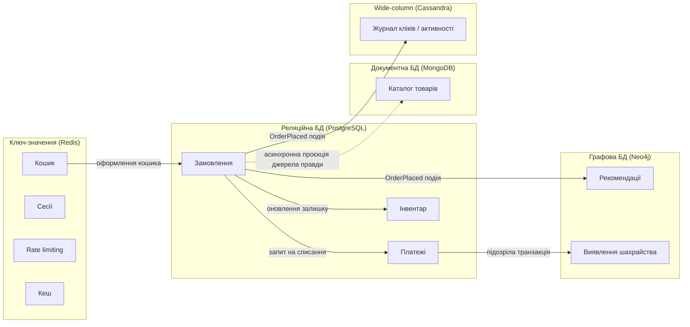

# Поліглотна персистентність: як обрати правильну БД — Підсумковий синтез (Senior)

> **Категорія:** Бази даних / Архітектурні рішення
> **Рівень:** Middle → Senior
> **Мова прикладів:** C# (.NET)

---

## Зміст

1. [Що таке поліглотна персистентність?](#що-таке-поліглотна-персистентність)
2. [Фреймворк для вибору бази даних](#фреймворк-для-вибору-бази-даних)
   - [Наскільки критична узгодженість даних?](#наскільки-критична-узгодженість-даних)
   - [Яка природна форма даних?](#яка-природна-форма-даних)
   - [Який профіль навантаження — читання чи запис переважає, і який масштаб?](#який-профіль-навантаження--читання-чи-запис-переважає-і-який-масштаб)
   - [Чи потрібні транзакції, що охоплюють кілька сутностей?](#чи-потрібні-транзакції-що-охоплюють-кілька-сутностей)
   - [Який очікуваний ріст, і наскільки дорого змінити рішення пізніше?](#який-очікуваний-ріст-і-наскільки-дорого-змінити-рішення-пізніше)
3. [Зведена порівняльна таблиця всіх розглянутих типів БД](#зведена-порівняльна-таблиця-всіх-розглянутих-типів-бд)
4. [Практичні приклади на C#](#практичні-приклади-на-c)
   - [Приклад 1: різні сховища за різними інтерфейсами в одному DI-контейнері](#приклад-1-різні-сховища-за-різними-інтерфейсами-в-одному-di-контейнері)
   - [Приклад 2: подієва синхронізація між сховищами](#приклад-2-подієва-синхронізація-між-сховищами)
5. [Реальний сценарій: повна архітектура даних великого інтернет-магазину](#реальний-сценарій-повна-архітектура-даних-великого-інтернет-магазину)
6. [Поширені помилки](#поширені-помилки)
7. [Питання для співбесіди за рівнями](#питання-для-співбесіди-за-рівнями)
8. [Підсумок серії](#підсумок-серії)

---

## Що таке поліглотна персистентність?

Уявіть добре обладнану столярну майстерню. У ній є молоток, викрутка, ножівка, дриль, рубанок. Ніхто не намагається зібрати шафу, використовуючи лише молоток — можна забити цвях молотком, але не можна ним свердлити отвір чи вирівняти поверхню дошки. Досвідчений майстер бере інструмент **під конкретну операцію**, а не намагається знайти один універсальний інструмент "на всі випадки життя".

**Поліглотна персистентність (polyglot persistence)** — це той самий принцип, застосований до зберігання даних. Термін означає, що велика реальна система рідко використовує лише одну технологію бази даних для всього. Замість цього різні підсистеми мають дійсно різні вимоги до доступу до даних — і сеньйор-архітектор свідомо обирає **різну, найбільш підходящу технологію бази даних для кожної підсистеми**, замість того щоб силоміць запихати все в одну.

Це не про моду і не про "чим більше технологій, тим круче резюме". Це про чесне визнання того факту, що:

- дані замовлення та платежу мають зовсім інші вимоги до узгодженості, ніж дані сесії кошика;
- граф "хто у кого купив" та "хто з ким пов'язаний" природно моделюється зовсім не так, як таблиця товарів;
- журнал кліків мільйонів користувачів на секунду має зовсім інший профіль запису, ніж таблиця замовлень.

Протягом усієї цієї серії ми детально розглянули: реляційну модель та нормалізацію, SQL, індекси та оптимізацію запитів, зберігання даних на диску, реплікацію та шардинг, ORM, бекапи та high availability, розподілені транзакції та Saga — а також документо-орієнтовані БД (MongoDB), ключ-значення сховища (Redis), wide-column БД (Cassandra), графові БД (Neo4j), теорему CAP і моделювання даних у NoSQL. Кожен з цих документів окремо показував, **як** влаштована конкретна технологія. Цей документ — про те, **коли** і **чому** обирати кожну з них, і як зібрати їх усі в одну узгоджену архітектуру.

### Два анти-патерни, яких варто уникати

Досвід індустрії показує дві протилежні крайності, і обидві є помилками рівня "недостатньо подумав":

**❌ Анти-патерн №1: "Просто використовуй Postgres для всього"**

Це вихідна позиція багатьох команд, і вона часто виправдана на старті проєкту (див. розділ [Поширені помилки](#поширені-помилки) — передчасна поліглотність теж шкідлива). Але коли систему використовують мільйони користувачів, і потрібно зберігати мільярди подій кліків на день, або будувати граф рекомендацій із мільйонами зв'язків — реляційна база технічно **може** це зробити, але ціною буде: повільні рекурсивні `JOIN`-и там, де потрібен обхід графа за один стрибок; вертикальне масштабування запису там, де потрібне горизонтальне; складні, крихкі індекси там, де wide-column БД дає це "з коробки" завдяки query-first моделюванню. Ігнорування реальних невідповідностей масштабу та форми даних — це технічний борг, а не консерватизм.

**❌ Анти-патерн №2: "NoSQL — це сучасно, використовуй його всюди"**

Симетрична помилка. NoSQL БД жертвують чимось заради масштабу та гнучкості — найчастіше строгою узгодженістю (`ACID`-транзакціями через кілька сутностей) або гнучкістю ad-hoc запитів і `JOIN`-ів. Для даних платежів, балансу рахунку, наявності товару на складі — тобто там, де невірне або втрачене оновлення має реальні фінансові чи юридичні наслідки — ця жертва неприйнятна. Обирати документну БД для даних замовлення тільки тому, що "NoSQL масштабується краще", ігноруючи, що вам насправді потрібні багато-рядкові транзакції та строгі гарантії — це resume-driven development, замасковане під архітектурне рішення.

**✅ Правильний підхід:** сеньйорська навичка — це **свідомий, обґрунтований вибір для кожної підсистеми окремо**, з чіткою відповіддю на питання "чому саме ця технологія для саме цих даних", а не універсальна відповідь "завжди X". Саме такий фреймворк ми і будуємо у наступному розділі.

---

## Фреймворк для вибору бази даних

Немає жорсткої блок-схеми "якщо A, то база X" — реальні рішення завжди балансують кілька факторів одночасно. Натомість є набір **правильних питань**, які сеньйор-інженер ставить собі перед вибором сховища для конкретного шматка даних. Пройдімося по кожному.

### Наскільки критична узгодженість даних?

Перше і найважливіше питання. Йдеться про те, наскільки дорого коштує **неправильне або втрачене оновлення** цих конкретних даних.

- **Гроші, інвентар, юридично значущі дані** (баланс рахунку, залишок товару на складі, статус оплати замовлення) — тут "загублене оновлення" (lost update) або read skew в неправильний момент означає подвійне списання коштів, продаж товару, якого вже немає в наявності, або юридичну суперечку. Тут потрібні строгі гарантії — рівні ізоляції транзакцій, описані в документі про [транзакції та ACID](../Реляційні/4-transactions-acid-and-isolation-levels.md), і, як правило, реляційна БД з підтримкою серіалізованих або хоча б repeatable-read транзакцій.
- **Дані перегляду, рекомендацій, лічильники, кеш** (кількість переглядів товару, "хто зараз онлайн", список "популярне зараз") — тут застаріле на кілька секунд значення нікому не зашкодить. Це саме той випадок, коли можна свідомо обрати eventual consistency заради швидкості та масштабу, як детально описано в документі про [моделювання даних та узгодженість у NoSQL](./6-nosql-data-modeling-and-consistency.md).

Практичне правило: **питайте не "яка узгодженість технічно можлива", а "яка ціна помилки в бізнес-термінах"**. Якщо ціна помилки — розбіжність у лічильнику лайків, це не привід ставити розподілену транзакцію. Якщо ціна помилки — подвійне списання грошей із картки клієнта, eventual consistency тут неприйнятна в принципі, незалежно від того, наскільки "модна" технологія, яка це пропонує.

### Яка природна форма даних?

Друге питання: якою **природно** є форма цих даних, ще до будь-яких міркувань про масштаб?

- **Глибоко вкладена, документо-подібна структура**, що зазвичай читається і записується цілим агрегатом (профіль товару з варіантами, характеристиками, відгуками; конфігурація, що читається одним запитом) → документна БД. Це саме той аргумент "embedding проти referencing", детально розібраний у документі з дизайну документів MongoDB — коли дані завжди читаються разом, зберігання їх разом як один документ усуває потребу в `JOIN`.
- **Граф зв'язків із глибокими обходами** (соціальний граф, "хто у кого купив", ланцюжки залежностей, виявлення шахрайських кілець через кілька рівнів посередників) → графова БД. Реляційна БД технічно може зберігати ребра графа в таблиці, але обхід графа глибиною 4-5 рівнів у SQL перетворюється на каскад самоз'єднань (`self-join`), що деградує експоненційно — саме тому графові БД, як описано в документі про Neo4j, зберігають зв'язки як БД-нативні структури, а не обчислюють їх на льоту.
- **Прості, ефемерні пари ключ→значення з величезною швидкістю доступу** (сесія, токен, кеш обчисленого значення, лічильник rate limiting) → ключ-значення сховище. Тут не потрібні ні складні запити, ні зв'язки — тільки `O(1)` доступ за ключем на швидкості пам'яті, як у Redis.
- **Табличні дані з реальними зв'язками, де потрібні `JOIN`-и та ad-hoc звіти** (замовлення ↔ клієнт ↔ товари ↔ знижки, довільна аналітика по цих зв'язках) → реляційна БД. Реляційна модель і нормалізація існують саме для того, щоб уникнути дублювання даних і надійно виражати зв'язки "багато-до-багатьох", а SQL — щоб довільно комбінувати ці зв'язки в запиті, якого автор схеми міг і не передбачити заздалегідь.

Ключова відмінність від наступного питання: тут ми питаємо про **форму** даних, а не про **обсяг** навантаження — ці два фактори часто тягнуть в один бік, але не завжди.

### Який профіль навантаження — читання чи запис переважає, і який масштаб?

Третє питання стосується не форми даних, а **того, як з ними працюють**.

- **Величезна пропускна здатність запису, горизонтальний масштаб на десятки й сотні вузлів, наперед відомі патерни запитів** (журнал кліків, IoT-телеметрія, аналітичні події) → wide-column сховище на кшталт Cassandra. Ключова ідея з документа про Cassandra — **query-first моделювання**: спочатку проєктують таблицю під конкретний запит (навіть якщо це означає дублювання даних у кількох "проекціях" однієї сутності), а не навпаки, як у реляційній нормалізації. Це свідомий обмін гнучкістю запитів на лінійне горизонтальне масштабування запису.
- **Помірний масштаб, потреба у гнучких ad-hoc запитах, звітності, `JOIN`-ах, яких на етапі проєктування могло і не бути** → реляційна БД, за потреби з read-репліками для розвантаження читання, як описано в документі про [реплікацію та шардинг](../Реляційні/6-replication-and-scaling-relational.md). Реплікація "один primary — кілька read-replica" — стандартний і перевірений спосіб масштабувати читання, не втрачаючи строгої узгодженості на запису.

Практичне правило: якщо ви наперед знаєте **точний список запитів**, які будуть виконуватись мільйони разів на секунду, і можете дозволити собі жертвувати гнучкістю заради запису — це сигнал у бік wide-column. Якщо запити довільні, змінюються з часом, і потрібна звітність "якою ще ніхто не думав запитувати" — це сигнал у бік реляційної БД.

### Чи потрібні транзакції, що охоплюють кілька сутностей?

Четверте питання — про межі атомарності.

- **Дійсно потрібні multi-entity ACID-гарантії в межах одного bounded context** (списати гроші з рахунку А і зарахувати на рахунок Б атомарно; зменшити залишок товару на складі одночасно зі створенням запису замовлення) → реляційна БД з повноцінними транзакціями, або — обережно і не зловживаючи — multi-document транзакції в самій MongoDB, як описано в документі про MongoDB: там explicitly підкреслюється, що multi-document транзакції існують, але їх варто використовувати як виняток, а не як основний робочий патерн, бо вони суперечать самій ідеї документної моделі "один документ — одна одиниця атомарності".
- **Операція перетинає межі кількох незалежно розгорнутих та підтримуваних сервісів** (замовлення в Order Service, оплата в Payment Service, доставка в Shipping Service) → тут розподілена ACID-транзакція (２-Phase Commit через сервіси) — це антипатерн: вона блокує ресурси на час мережевих запитів між сервісами і робить систему крихкою до відмови будь-якого з них. Правильний підхід, детально розібраний у документі про [розподілені транзакції та Saga](../Реляційні/9-distributed-transactions-and-saga.md) — патерн Saga: послідовність локальних транзакцій, кожна зі своєю компенсуючою дією на випадок відкату.

Практичне правило: **межа сервісу — це майже завжди межа транзакції**. Якщо дані належать одному сервісу й одній БД — це кандидат на звичайну ACID-транзакцію. Якщо дані розкидані по кількох сервісах — це кандидат на Saga, а не на спробу "розтягнути" транзакцію через мережу.

### Який очікуваний ріст, і наскільки дорого змінити рішення пізніше?

П'яте питання — найменш формалізоване і найбільш "сеньйорське". Це вже не формула, а судження, що враховує:

- **Наскільки реалістичний прогнозований ріст?** Не варто з першого дня будувати шардовану Cassandra-кластерну архітектуру під навантаження, якого у вас, можливо, ніколи не буде — це over-engineering, що коштує реальних грошей і часу команди вже сьогодні заради гіпотетичного майбутнього.
- **Наскільки дорого буде мігрувати, якщо прогноз виявиться невірним?** Тут баланс протилежний: якщо обрана сьогодні технологія настільки тісно вплетена в бізнес-логіку (наприклад, ви покладаєтесь на специфічні для конкретної БД гарантії або API у сотнях місць коду), що перехід на іншу технологію за рік коштуватиме місяців переписування — варто закласти трохи запасу гнучкості вже зараз, навіть якщо поточний масштаб цього формально не вимагає.

Це справжній компроміс, а не формула: занадто консервативний вибір ("почнемо з SQLite і подивимось") може означати болючу міграцію під тиском вже за кілька місяців; занадто передбачливий вибір ("одразу розгорнемо розподілену wide-column БД про всяк випадок") може означати, що команда роками платить операційну ціну за складність, якою ніколи не скористається повною мірою. Сеньйорська відповідальність — явно проговорити цей компроміс із командою й бізнесом, а не мовчки прийняти рішення в один бік.

---

## Зведена порівняльна таблиця всіх розглянутих типів БД

Ця таблиця — "шпаргалка шпаргалок" для всієї серії документів про бази даних. Кожен рядок підсумовує один тип БД, розглянутий окремим документом.

| Тип БД | Модель даних | Модель узгодженості (CAP / PACELC) | Профіль масштабованості | Гнучкість запитів | Найкраще підходить для | Приклад із серії |
|---|---|---|---|---|---|---|
| **Реляційна** | Таблиці, рядки, стовпці, зовнішні ключі, нормалізовані зв'язки | Зазвичай CP: строга узгодженість (ACID), навіть ціною доступності при партиції; PACELC: за відсутності партиції — вибір між латентністю (`E`) і строгою узгодженістю (`C`) | Вертикальне масштабування "з коробки"; горизонтальне — через read-репліки та шардинг, потребує зусиль | Дуже висока: довільні `JOIN`-и, агрегації, ad-hoc SQL-запити | Гроші, платежі, інвентар, будь-які дані, де multi-entity транзакції та цілісність критичні | PostgreSQL / SQL Server |
| **Документна** | Самодостатні JSON/BSON-подібні документи, вкладені структури, гнучка схема | Зазвичай AP за замовчуванням, але дозволяє налаштування (`majority`/`linearizable` read/write concern) — це CP-режим за потреби; PACELC: явний вибір `E` проти `C` через read/write concern | Горизонтальне через шардинг за ключем шардування; читання масштабується реплік-сетами | Висока в межах документа; обмежена між документами (потребує `$lookup` або referencing) | Каталоги товарів, профілі користувачів, вкладені агрегати, що завжди читаються разом | MongoDB |
| **Ключ-значення** | Пара ключ → значення (рядок, хеш, список, множина, sorted set) | Зазвичай AP, налаштовувана; одновузловий Redis — строго послідовний за замовчуванням для одного інстансу | Горизонтальне через кластерний режим (хеш-слоти); вертикальне для одновузлових інстансів | Дуже низька: тільки доступ за ключем, без довільних запитів по значенню | Кеш, сесії, rate limiting, чергі, ефемерні дані з TTL | Redis |
| **Wide-column** | Розширювані рядки, згруповані в column families, партиційовані за partition key + clustering columns | AP за замовчуванням із налаштовуваним рівнем узгодженості на запит (`ONE`, `QUORUM`, `ALL`); PACELC: eventual consistency заради доступності та латентності | Лінійне горизонтальне масштабування запису на сотні вузлів "з коробки" | Низька: query-first моделювання, запити обмежені наперед спроєктованими таблицями | Журнали подій, часові ряди, телеметрія, величезний обсяг запису при відомих запитах | Cassandra |
| **Графова** | Вузли (nodes) та ребра (relationships) з властивостями, ребра — БД-нативні об'єкти першого класу | Зазвичай CP на одному інстансі (строга узгодженість у межах транзакції); кластерні режими propagavailable змінюють цей баланс | Вертикальне масштабування читання (кеш графа в пам'яті); горизонтальне складніше через природу обходів графа | Дуже висока для запитів "зв'язки та шляхи" (`MATCH`, обхід за N кроків); низька для табличної агрегації | Рекомендації, соціальні графи, виявлення шахрайства, аналіз залежностей | Neo4j |

> 🧭 **Як читати цю таблицю під час вибору БД:** знайдіть рядок, форма даних і профіль навантаження якого найближче збігається з вашим сценарієм, а потім перевірте стовпець "модель узгодженості" на предмет того, чи прийнятна ця модель для ціни помилки у вашому конкретному випадку (перше питання фреймворку вище). Якщо жоден рядок не підходить ідеально — це нормально: реальні системи використовують кілька рядків одночасно, це і є поліглотна персистентність.

---

## Практичні приклади на C#

Наступні приклади навмисно не фокусуються на API конкретної БД (це вже детально показано в профільних документах серії) — вони показують **архітектуру** застосунку, що дійсно використовує кілька технологій одночасно.

### Приклад 1: різні сховища за різними інтерфейсами в одному DI-контейнері

Реальний поліглотний застосунок організований так: кожна підсистема має власний інтерфейс репозиторію/сховища, і кожен інтерфейс має власну, найбільш підходящу реалізацію. Каталог товарів (переглядається часто, змінюється рідко, форма — вкладений документ) живе в MongoDB. Замовлення (потребують ACID-транзакцій, зв'язків із клієнтом і оплатою) живуть у реляційній БД через EF Core. Обидва інтерфейси зареєстровані в одному DI-контейнері й використовуються пліч-о-пліч в одному робочому процесі.

```csharp
// ---------- Абстракції підсистем ----------

// Підсистема каталогу: читання товарів для вітрини магазину.
// Форма даних — вкладений документ (назва, ціна, характеристики, варіанти) —
// природний кандидат на документну модель, як описано в документі про MongoDB.
public interface IProductCatalogReadStore
{
    Task<ProductView?> FindByIdAsync(string productId);
    Task<bool> IsInStockAsync(string productId, int quantity);
}

public sealed record ProductView(string Id, string Name, decimal Price, int StockQuantity);

// Реалізація на MongoDB (спрощено — деталі роботи з драйвером Mongo
// розглянуті в профільному документі про документні БД).
public sealed class MongoProductCatalogReadStore : IProductCatalogReadStore
{
    private readonly IMongoCollection<ProductDocument> _products;

    public MongoProductCatalogReadStore(IMongoDatabase database)
    {
        _products = database.GetCollection<ProductDocument>("products");
    }

    public async Task<ProductView?> FindByIdAsync(string productId)
    {
        var filter = Builders<ProductDocument>.Filter.Eq(p => p.Id, productId);
        var doc = await _products.Find(filter).FirstOrDefaultAsync();
        return doc is null
            ? null
            : new ProductView(doc.Id, doc.Name, doc.Price, doc.StockQuantity);
    }

    public async Task<bool> IsInStockAsync(string productId, int quantity)
    {
        var product = await FindByIdAsync(productId);
        return product is not null && product.StockQuantity >= quantity;
    }

    private sealed class ProductDocument
    {
        public string Id { get; set; } = default!;
        public string Name { get; set; } = default!;
        public decimal Price { get; set; }
        public int StockQuantity { get; set; }
    }
}

// ---------- Підсистема замовлень ----------

// Замовлення потребують ACID-транзакцій (зменшення залишку + створення замовлення
// атомарно), тому це кандидат на реляційну БД, як обговорено у фреймворку вище.
public interface IOrderStore
{
    Task<Guid> PlaceOrderAsync(string customerId, string productId, int quantity, decimal totalPrice);
}

public sealed class EfCoreOrderStore : IOrderStore
{
    private readonly OrderDbContext _db;

    public EfCoreOrderStore(OrderDbContext db) => _db = db;

    public async Task<Guid> PlaceOrderAsync(
        string customerId, string productId, int quantity, decimal totalPrice)
    {
        // Один DbContext.SaveChanges = одна ACID-транзакція реляційної БД,
        // як описано в документі про транзакції та ACID.
        var order = new OrderEntity
        {
            Id = Guid.NewGuid(),
            CustomerId = customerId,
            ProductId = productId,
            Quantity = quantity,
            TotalPrice = totalPrice,
            Status = "Pending",
            CreatedAtUtc = DateTime.UtcNow
        };

        _db.Orders.Add(order);
        await _db.SaveChangesAsync();
        return order.Id;
    }
}

public sealed class OrderEntity
{
    public Guid Id { get; set; }
    public string CustomerId { get; set; } = default!;
    public string ProductId { get; set; } = default!;
    public int Quantity { get; set; }
    public decimal TotalPrice { get; set; }
    public string Status { get; set; } = default!;
    public DateTime CreatedAtUtc { get; set; }
}

public sealed class OrderDbContext : DbContext
{
    public DbSet<OrderEntity> Orders => Set<OrderEntity>();

    public OrderDbContext(DbContextOptions<OrderDbContext> options) : base(options) { }
}

// ---------- Реєстрація в DI-контейнері ----------

var builder = Host.CreateApplicationBuilder(args);

builder.Services.AddSingleton<IMongoDatabase>(_ =>
    new MongoClient("mongodb://localhost:27017").GetDatabase("shop_catalog"));
builder.Services.AddScoped<IProductCatalogReadStore, MongoProductCatalogReadStore>();

builder.Services.AddDbContext<OrderDbContext>(opt =>
    opt.UseNpgsql("Host=localhost;Database=shop_orders;Username=app;Password=app"));
builder.Services.AddScoped<IOrderStore, EfCoreOrderStore>();

using var host = builder.Build();

// ---------- Використання обох сховищ разом в одному робочому процесі ----------

async Task PlaceOrderWorkflowAsync(IServiceProvider services, string customerId, string productId, int quantity)
{
    using var scope = services.CreateScope();
    var catalog = scope.ServiceProvider.GetRequiredService<IProductCatalogReadStore>();
    var orders = scope.ServiceProvider.GetRequiredService<IOrderStore>();

    // 1. Перевіряємо товар у MongoDB-каталозі.
    var product = await catalog.FindByIdAsync(productId);
    if (product is null)
    {
        Console.WriteLine($"Товар {productId} не знайдено в каталозі.");
        return;
    }

    if (!await catalog.IsInStockAsync(productId, quantity))
    {
        Console.WriteLine($"Недостатньо товару {product.Name} на складі.");
        return;
    }

    // 2. Розміщуємо замовлення в реляційному Order-сховищі.
    var totalPrice = product.Price * quantity;
    var orderId = await orders.PlaceOrderAsync(customerId, productId, quantity, totalPrice);

    Console.WriteLine(
        $"Замовлення {orderId} на '{product.Name}' x{quantity} " +
        $"на суму {totalPrice:C} успішно створено.");
}

await PlaceOrderWorkflowAsync(host.Services, customerId: "cust-42", productId: "prod-7", quantity: 2);

// Приклад консольного виводу:
// Замовлення 3f9a1c22-...-e7b0 на 'Бездротова клавіатура' x2 на суму ₴1 598,00 успішно створено.
```

Ключовий архітектурний момент цього прикладу: **бізнес-логіка workflow не знає і не повинна знати**, що `IProductCatalogReadStore` реалізований поверх MongoDB, а `IOrderStore` — поверх PostgreSQL через EF Core. Кожен інтерфейс — це межа підсистеми, за якою ховається технологія зберігання, найкраще підібрана саме під потреби цієї підсистеми.

### Приклад 2: подієва синхронізація між сховищами

У поліглотній архітектурі авторитетне джерело правди (source of truth) для якихось даних — одна БД, а інші сховища тримають похідні, вторинні копії цих даних для власних потреб (швидкий кеш, граф для рекомендацій). Ці копії потрібно тримати в узгодженому стані — і найпоширеніший спосіб зробити це без жорсткого зв'язування підсистем — подієва модель, що є прямим застосуванням патерну **Observer** із серії патернів проєктування цього репозиторію, поєднаного з ідеєю eventual consistency з NoSQL-серії.

```csharp
// ---------- Подія та видавець (Subject у термінах Observer) ----------

public sealed record OrderPlacedEvent(Guid OrderId, string CustomerId, string ProductId, int Quantity);

// Спрощений синхронний in-memory event bus — на практиці роль publisher/subscriber
// виконує черга повідомлень (Kafka, RabbitMQ, Service Bus), але сама ідея
// "один запис у первинне сховище публікує подію, на яку підписані вторинні
// сховища" не змінюється.
public interface IEventPublisher
{
    Task PublishAsync(OrderPlacedEvent evt);
}

public sealed class InMemoryEventBus : IEventPublisher
{
    private readonly List<Func<OrderPlacedEvent, Task>> _handlers = new();

    public void Subscribe(Func<OrderPlacedEvent, Task> handler) => _handlers.Add(handler);

    public async Task PublishAsync(OrderPlacedEvent evt)
    {
        // Обробники виконуються незалежно одне від одного —
        // збій одного обробника не повинен ламати первинний запис у Order-БД,
        // який уже відбувся й закомічений.
        foreach (var handler in _handlers)
        {
            try
            {
                await handler(evt);
            }
            catch (Exception ex)
            {
                // У реальній системі — лог, ретраї, dead-letter queue.
                Console.WriteLine($"Обробник синхронізації впав: {ex.Message}");
            }
        }
    }
}

// ---------- Первинне сховище (авторитетне джерело правди) публікує подію ----------

public sealed class EfCoreOrderStoreWithEvents : IOrderStore
{
    private readonly OrderDbContext _db;
    private readonly IEventPublisher _events;

    public EfCoreOrderStoreWithEvents(OrderDbContext db, IEventPublisher events)
    {
        _db = db;
        _events = events;
    }

    public async Task<Guid> PlaceOrderAsync(
        string customerId, string productId, int quantity, decimal totalPrice)
    {
        var order = new OrderEntity
        {
            Id = Guid.NewGuid(),
            CustomerId = customerId,
            ProductId = productId,
            Quantity = quantity,
            TotalPrice = totalPrice,
            Status = "Pending",
            CreatedAtUtc = DateTime.UtcNow
        };

        _db.Orders.Add(order);
        await _db.SaveChangesAsync(); // Первинний запис — авторитетний і вже ACID-гарантований.

        // Подія публікується ПІСЛЯ успішного коміту в первинну БД,
        // не раніше — інакше вторинні сховища могли б дізнатись про замовлення,
        // якого насправді не існує (якщо транзакція потім відкотиться).
        await _events.PublishAsync(new OrderPlacedEvent(order.Id, customerId, productId, quantity));

        return order.Id;
    }
}

// ---------- Вторинні сховища-підписники ----------

// Redis-кеш "останні замовлення клієнта" — прискорює читання, яке інакше
// било б у реляційну БД для кожного показу профілю клієнта.
public sealed class RedisRecentOrdersCacheUpdater
{
    private readonly IDatabase _redis;

    public RedisRecentOrdersCacheUpdater(IDatabase redis) => _redis = redis;

    public Task HandleAsync(OrderPlacedEvent evt)
    {
        var key = $"customer:{evt.CustomerId}:recent-orders";
        // Cache-aside у зворотному напрямку: замість "промах кешу -> читаємо з БД
        // і кладемо в кеш", тут первинний запис одразу проактивно оновлює кеш.
        return _redis.ListLeftPushAsync(key, evt.OrderId.ToString())
            .ContinueWith(_ => _redis.KeyExpireAsync(key, TimeSpan.FromHours(24)));
    }
}

// Граф рекомендацій у Neo4j — оновлюємо зв'язок "клієнт КУПИВ товар",
// який пізніше живить запити "клієнти, що купили X, також купували Y".
public sealed class GraphRecommendationUpdater
{
    private readonly IDriver _neo4jDriver;

    public GraphRecommendationUpdater(IDriver neo4jDriver) => _neo4jDriver = neo4jDriver;

    public async Task HandleAsync(OrderPlacedEvent evt)
    {
        await using var session = _neo4jDriver.AsyncSession();
        await session.ExecuteWriteAsync(tx => tx.RunAsync(
            @"MERGE (c:Customer {id: $customerId})
              MERGE (p:Product {id: $productId})
              MERGE (c)-[r:PURCHASED]->(p)
              ON CREATE SET r.firstPurchasedAt = datetime()
              SET r.timesPurchased = coalesce(r.timesPurchased, 0) + $quantity",
            new { customerId = evt.CustomerId, productId = evt.ProductId, quantity = evt.Quantity }));
    }
}

// ---------- Зв'язування всього разом ----------

var eventBus = new InMemoryEventBus();
eventBus.Subscribe(evt => new RedisRecentOrdersCacheUpdater(redisDb).HandleAsync(evt));
eventBus.Subscribe(evt => new GraphRecommendationUpdater(neo4jDriver).HandleAsync(evt));

var orderStore = new EfCoreOrderStoreWithEvents(orderDbContext, eventBus);
var orderId = await orderStore.PlaceOrderAsync("cust-42", "prod-7", 2, 1598.00m);

// Консольний вивід (спрощено):
// [Order DB] Замовлення 3f9a1c22-... закомічено.
// [Redis] customer:cust-42:recent-orders <- 3f9a1c22-... (TTL 24h)
// [Neo4j] (Customer cust-42)-[:PURCHASED {timesPurchased: 2}]->(Product prod-7) оновлено
```

Це саме те, як "різні бази даних лишаються приблизно узгодженими" в реальній поліглотній архітектурі: **первинне сховище — джерело правди, події — механізм поширення, вторинні сховища — прийнятно тимчасово застарілі (eventually consistent) проєкції тих самих даних під свої власні патерни запитів.** Помітьте паралель із патерном Observer: `EfCoreOrderStoreWithEvents` — це Subject, який не знає і не повинен знати, скільки і яких Observer-обробників на нього підписано.

---

## Реальний сценарій: повна архітектура даних великого інтернет-магазину

Це кульмінаційний розділ усієї серії. Зберемо докупи повну картину даних для того самого великого інтернет-магазину, який був наскрізним прикладом і в реляційній, і в NoSQL частинах серії. Компаньйон цього розділу — файл `ecommerce-architecture-guide.md` у корені репозиторію, який описує ту саму систему з боку **прикладної логіки й патернів проєктування** (наприклад, патерн State для життєвого циклу замовлення). Цей розділ — відповідь на те саме питання, але з боку **шару даних**.

### Карта підсистем і обраних технологій



### Замовлення, платежі, інвентар → Реляційна БД (PostgreSQL / SQL Server)

**Чому саме так, за фреймворком з розділу 2:**

- *Узгодженість:* це найкритичніші дані в усій системі — гроші (платежі) та наявність товару (інвентар). Помилка тут — це подвійне списання, продаж товару, якого вже немає, або розбіжність бухгалтерського балансу. Це прямий приклад "лідируючого" фактора з питання про критичність узгодженості — тут потрібні строгі рівні ізоляції, детально розглянуті в документі про [транзакції та ACID](../Реляційні/4-transactions-acid-and-isolation-levels.md).
- *Форма даних:* замовлення — це, по суті, табличні дані з реальними зв'язками "багато-до-багатьох" (замовлення ↔ товари ↔ знижки ↔ клієнт), для яких нормалізована реляційна модель, описана в документі про [реляційну модель та нормалізацію](../Реляційні/1-relational-model-and-normalization.md), природно уникає дублювання й аномалій оновлення.
- *Транзакційність:* оформлення замовлення атомарно зменшує залишок товару та створює запис замовлення — класичний приклад multi-entity ACID-транзакції в межах одного bounded context.
- *Життєвий цикл замовлення* (`Pending` → `Paid` → `Shipped` → `Delivered` / `Cancelled`) реалізовано патерном **State**, детально описаним у `ecommerce-architecture-guide.md` — шар даних і шар прикладної логіки тут працюють у парі: реляційна БД гарантує, що перехід стану коміситься атомарно разом із будь-якими супутніми змінами (наприклад, списанням залишку при переході в `Paid`).
- Читання для звітності та аналітики знімається з навантаження запису за допомогою read-реплік, як описано в документі про [реплікацію та шардинг](../Реляційні/6-replication-and-scaling-relational.md).

### Каталог товарів (перегляд) → Документна БД (MongoDB)

**Чому саме так:**

- *Форма даних:* картка товару — це природно вкладена структура: назва, опис, ціна, масив характеристик, масив варіантів (розмір/колір), масив відгуків із рейтингом. Це саме той сценарій "документ читається одним запитом як єдиний агрегат", що описаний у документі про MongoDB, де обговорюється рішення embedding проти referencing — тут переважає embedding: варіанти й характеристики завжди читаються разом із самим товаром, тож дублювання незначного обсягу даних виправдане заради уникнення `JOIN`-подібних операцій при кожному перегляді сторінки товару.
- *Профіль навантаження:* перегляд каталогу — це читання, що на порядки перевищує запис (мільйони переглядів картки товару на кожну зміну ціни чи опису). Гнучка схема документної моделі також добре пасує тут: різні категорії товарів (електроніка, одяг, книги) мають зовсім різний набір характеристик, і змушувати їх усі в одну жорстку реляційну схему призвело б або до величезної кількості `NULL`-стовпців, або до патерну EAV (Entity-Attribute-Value), який документ про індекси й оптимізацію запитів явно називає антипатерном для реляційних БД.
- **Важливий нюанс:** MongoDB тут — **не** єдине джерело правди про товар. Авторитетним джерелом залишається реляційна БД (або, залежно від масштабу конкретної системи, wide-column БД для товарів з екстремальним обсягом атрибутів), а MongoDB-каталог — це асинхронно оновлювана, оптимізована під читання проєкція, що живиться подіями зі зміни товару (`ProductUpdatedEvent`), точно за тим самим принципом подієвої синхронізації, показаним у [Прикладі 2](#приклад-2-подієва-синхронізація-між-сховищами) вище. Це свідома, задокументована eventual consistency: невелика затримка між зміною ціни в первинній системі та її появою у вітрині каталогу прийнятна для бізнесу.

### Кошик, сесії, rate limiting, кешування → Ключ-значення (Redis)

**Чому саме так:**

- *Природа даних:* усе перелічене тут — ефемерні дані з природним TTL (кошик неавторизованого відвідувача, сесія входу, лічильник запитів для rate limiting, кешований результат важкого запиту). Втрата цих даних при збої — прикра, але не катастрофічна подія (на відміну від втрати запису про сплачене замовлення), що прямо відповідає на перше питання фреймворку: ціна помилки тут низька.
- *Профіль навантаження:* потрібна швидкість доступу на рівні пам'яті та величезна кількість операцій за секунду (кожен запит сторінки перевіряє сесію; кожен API-виклик перевіряє rate limit) — саме те, під що Redis спроєктовано.
- *Патерн:* кешування каталогу товарів і результатів важких агрегацій у Redis реалізоване через **Cache-Aside**, описаний у документі про Redis: застосунок спершу перевіряє кеш, і лише при промаху звертається до первинного сховища (MongoDB-каталогу чи реляційної БД), після чого кладе результат у кеш із TTL. Кошик зберігається як Redis hash із TTL у кілька днів — якщо покупець не завершив оформлення замовлення, кошик природно "згасає" без потреби у фоновому job'і очищення.

### Журнал кліків / активності → Wide-column (Cassandra)

**Чому саме так:**

- *Профіль навантаження:* це найбільший за обсягом запису потік даних у всій системі — кожен клік, перегляд сторінки, скрол, наведення на товар мільйонів одночасних відвідувачів. Тут визначальний фактор — саме профіль навантаження запис/масштаб, а не форма даних чи критичність узгодженості (втрата поодинокої події кліку не критична).
- *Моделювання:* таблиці спроєктовано query-first, за принципом із документа про Cassandra: наперед відомо, що основний запит — "дай мені всі події користувача X за останню добу, впорядковані за часом" — тож partition key = `user_id`, clustering column = `timestamp`, і саме під цей конкретний запит побудована структура таблиці, навіть якщо це означає окрему денормалізовану таблицю для запиту "дай усі перегляди товару Y" замість спроби зробити одну "універсальну" нормалізовану таблицю подій.
- *Узгодженість:* тут прийнятний рівень consistency `ONE` або `QUORUM` при записі — можна дозволити собі невелику ймовірність втрати чи затримки поодинокої аналітичної події заради лінійного горизонтального масштабування на сотні вузлів, що обробляють запис.

### Рекомендації, виявлення шахрайства → Графова БД (Neo4j)

**Чому саме так:**

- *Форма даних:* "клієнти, що купили товар X, також купували товар Y" — це запит на обхід графа глибиною 2 (клієнт → купив → товар ← купив ← інший клієнт → купив → інший товар), природно виражений як `MATCH`-патерн у Cypher, як показано в документі про Neo4j. У реляційній моделі цей самий запит перетворюється на кілька самоз'єднань таблиці замовлень, що деградує при зростанні глибини обходу.
- *Виявлення шахрайства:* виявлення "кільця шахрайства" (кілька облікових записів, що використовують одну картку оплати, одну IP-адресу чи одну адресу доставки для координованих фіктивних замовлень) — це за своєю природою пошук патернів зв'язків через кілька проміжних вузлів, ще один приклад запиту, для якого графова модель є природним інструментом, а не реляційним "хаком" через рекурсивні CTE.
- **Потік даних:** граф рекомендацій оновлюється асинхронно з події `OrderPlaced`, що народжується в реляційній Order-БД, точно за архітектурою з [Прикладу 2](#приклад-2-подієва-синхронізація-між-сховищами): кожне нове замовлення додає чи підсилює ребро `(Customer)-[:PURCHASED]->(Product)` у графі. Це ще одна eventually consistent проєкція первинних даних — рекомендація, що на кілька секунд відстає від щойно оформленого замовлення, не завдає жодної шкоди бізнесу.

### Наскрізний потік однієї події: "замовлення розміщено"

Щоб зробити картину до кінця конкретною, простежимо, куди фізично летять дані після одного натискання кнопки "Оформити замовлення":

1. **Reляційна Order-БД (синхронно, в одній ACID-транзакції):** створюється запис замовлення зі статусом `Pending` (патерн State з `ecommerce-architecture-guide.md`), одночасно резервується/зменшується залишок у таблиці інвентарю. Це єдина частина всього потоку, що має бути строго узгодженою і синхронною — все інше нижче є асинхронним і eventually consistent.
2. **Redis (синхронно, до підтвердження користувачу):** кошик користувача очищається (оформлений кошик більше не потрібен), лічильник rate limiting перевіряється, щоб не допустити зловживання оформленням замовлень ботом.
3. **Подія `OrderPlaced` публікується** (через чергу повідомлень у реальній системі — Kafka/RabbitMQ/Service Bus, спрощено показано через `InMemoryEventBus` у [Прикладі 2](#приклад-2-подієва-синхронізація-між-сховищами)) **після** успішного коміту кроку 1.
4. **Асинхронно, кожен незалежно один від одного:**
   - **Cassandra:** новий запис у таблиці активності клієнта — "клієнт X оформив замовлення Y о часі T" — доповнює журнал кліків аналітичною подією.
   - **Neo4j:** ребро `PURCHASED` між клієнтом і кожним товаром замовлення створюється чи підсилюється, живлячи майбутні рекомендації; паралельно оновлюються графові метрики для виявлення шахрайства (наприклад, зв'язок цієї картки оплати з іншими обліковими записами).
   - **MongoDB-каталог:** якщо оформлення замовлення впливає на відображувану інформацію (наприклад, лічильник "залишилось N штук" у вітрині), проєкція каталогу оновлюється з невеликою затримкою.
5. **Гарантія узгодженості на кожному кроці — різна, і це свідомий вибір:** крок 1 — строга (ACID); крок 2 — практично строга, з малою ціною помилки; кроки 4 — eventual consistency, з очікуваною затримкою від мілісекунд до кількох секунд, і це прийнятно, тому що жоден із цих трьох вторинних записів не є юридично чи фінансово значущим сам по собі.

Саме ця картина — **не єдина база даних "яка вирішує все", а свідомо спроєктований ланцюжок сховищ, кожне з яких відповідає за свою частину і синхронізується через події** — і є практичною відповіддю на питання "як сеньйор-архітектор проєктує шар даних великого інтернет-магазину". Компаньйонний документ `ecommerce-architecture-guide.md` показує, як та сама система виглядає з боку прикладних патернів (Command для операцій оформлення, Observer для сповіщень, State для життєвого циклу замовлення, Strategy для розрахунку доставки й знижок) — обидва документи описують одну й ту саму систему, кожен зі свого боку.

---

## Поширені помилки

**❌ Погано: поліглотна персистентність для маленької системи "про всяк випадок"**

Команда з 4 розробниками будує MVP інтернет-магазину і з першого дня розгортає окремо PostgreSQL, MongoDB, Redis, Cassandra та Neo4j — "щоб було правильно з архітектурної точки зору". У результаті на другому тижні розробки половина часу команди йде не на бізнес-логіку, а на підтримку п'яти різних СУБД: п'ять способів бекапу, п'ять способів моніторингу, п'ять наборів облікових даних для доступу, і жоден розробник у команді не знає всіх п'яти технологій на рівні, достатньому для впевненого дебагу проблем у продакшені.

**✅ Добре:** для системи, що ще не має мільйонів користувачів і не зіткнулась із реальною невідповідністю масштабу чи форми даних, добре обрана реляційна БД (PostgreSQL) із правильно спроєктованою схемою і індексами покриває переважну більшість підсистем — включно з кошиком (звичайна таблиця з TTL-очищенням за cron-задачею), каталогом (таблиці з `JSONB`-стовпцем для гнучких характеристик там, де це виправдано) і навіть найпростішими рекомендаціями (запит "інші, хто купив X, також купували Y" через `JOIN`, цілком прийнятний при помірному обсязі даних). Додавайте нову технологію в стек лише тоді, коли **конкретна, вимірювана** проблема (реальний перевантажений запис, реальна недостатня гнучкість запитів для конкретного домену) виправдовує операційну ціну ще однієї СУБД у продакшені.

**❌ Погано: вибір бази даних через моду, а не через відповідність навантаженню (resume-driven development)**

Розробник нещодавно прочитав статтю про Cassandra й хоче використати її для... таблиці користувачів у застосунку з тисячею активних клієнтів. Обґрунтування — "Cassandra масштабується краще за реляційні БД". Але таблиця користувачів має помірний обсяг, потребує гнучких ad-hoc запитів (звіти для служби підтримки, аналітика для маркетингу), і майже напевно ніколи не наблизиться до масштабу, де query-first обмеження Cassandra виправдані. Це саме той "модний вибір без реальних вимог", проти якого явно застерігає документ про CAP-теорему та огляд NoSQL цієї серії.

**✅ Добре:** вибір технології завжди має явне письмове обґрунтування, що посилається на конкретні пункти фреймворку з розділу 2 ("тут потрібна пропускна здатність запису N подій/сек, наперед відомі запити X і Y, ціна втрати поодинокого запису низька" — а не "це модно"). На архітектурному рев'ю варто прямо ставити запитання: "Якою конкретно вимогою навантаження чи форми даних виправданий цей вибір, і яка альтернатива була відкинута й чому?" Відсутність чіткої відповіді — червоний прапорець resume-driven development.

**❌ Погано: відсутність плану синхронізації даних між кількома сховищами**

Команда розгорнула MongoDB-каталог і реляційну Order-БД, обидві містять ціну товару. Оновлення ціни товару потрапляє тільки в реляційну БД (через адмін-панель), а MongoDB-каталог оновлюється вручну кимось "коли згадають", або взагалі через окремий, ніким не задокументований batch-скрипт, що іноді падає без сповіщення. За кілька місяців ціни в каталозі й реляційній БД тихо розходяться — покупці бачать одну ціну на вітрині, а замовлення оформляється за іншою, і ніхто в команді не знає, наскільки сильно розійшлися дані, доки скарга клієнта не доводить це до відома.

**✅ Добре:** з першого дня, коли в архітектурі з'являється друга копія тих самих даних в іншому сховищі, одразу проєктується явний, спостережуваний механізм синхронізації — подієва модель на кшталт показаної в [Прикладі 2](#приклад-2-подієва-синхронізація-між-сховищами) вище (з чергою повідомлень, dead-letter queue для повідомлень, що не вдалось обробити, і метриками затримки реплікації), або, для менших систем, регулярний, моніторений batch-процес звірки (reconciliation job), що явно логує та алертить про розбіжності. Питання "як ці дві копії лишаються синхронізованими і що станеться, якщо синхронізація впаде на годину" повинно мати чітку, задокументовану відповідь ще на етапі проєктування архітектури — не бути "проблемою для майбутнього себе".

---

## Питання для співбесіди за рівнями

### Middle

**1. Що таке поліглотна персистентність простими словами?**

Це підхід до архітектури даних, за якого велика система свідомо використовує кілька різних технологій баз даних одночасно — по одній (або кілька) для кожної підсистеми, обираючи технологію під конкретні потреби цієї підсистеми, замість того щоб намагатись зберігати всі дані системи в одній базі даних одного типу.

**2. Наведи приклад підсистеми, для якої добре підходить кожен з розглянутих типів БД.**

Реляційна — замовлення й платежі (потрібні ACID-транзакції та зв'язки). Документна (MongoDB) — каталог товарів (вкладена, гнучка структура, часте читання). Ключ-значення (Redis) — кошик покупок і сесії (ефемерні дані, TTL, швидкість). Wide-column (Cassandra) — журнал кліків користувачів (величезний обсяг запису, наперед відомі запити). Графова (Neo4j) — рекомендації товарів і виявлення шахрайства (запити на обхід зв'язків).

**3. Чому не можна просто завжди використовувати одну "найкращу" базу даних для всього?**

Тому що "найкраща" завжди залежить від контексту: жодна технологія не оптимізує одночасно строгу узгодженість, гнучкість ad-hoc запитів, горизонтальний масштаб запису та швидкість обходу графових зв'язків — кожна технологія свідомо жертвує чимось заради переваг в іншому. Реляційна БД жертвує лінійним масштабуванням запису заради ACID і гнучкості `JOIN`-ів; wide-column БД жертвує гнучкістю запитів заради масштабу запису; документна БД жертвує простотою міждокументних зв'язків заради природності вкладених структур.

**4. Що таке eventual consistency і коли її прийнятно використовувати?**

Це модель, за якою після запису різні репліки чи вторинні сховища даних тимчасово можуть повертати застарілі значення, але з часом (за відсутності нових записів) гарантовано "доганяють" до узгодженого стану. Прийнятно використовувати там, де ціна показу тимчасово застарілих даних низька — лічильники переглядів, рекомендації, кеші — і неприйнятно там, де застарілі дані означають реальну фінансову чи юридичну помилку, наприклад баланс рахунку чи статус оплати.

**5. Що з переліченого варто зберігати в Redis, а що — ні: пароль користувача, токен сесії, баланс банківського рахунку, кешований результат важкого SQL-запиту?**

Токен сесії й кешований результат запиту — так, це саме те, для чого призначений Redis: швидкий доступ до ефемерних чи похідних даних з TTL. Пароль користувача (у відкритому вигляді чи навіть хешований як єдине джерело правди) і баланс банківського рахунку — ні: це дані з високою ціною помилки чи втрати, для яких потрібна строга узгодженість і довговічне, надійне зберігання — місце цих даних у реляційній БД (пароль — у вигляді хеша, як частина основного облікового запису користувача).

### Senior

**1. Спроєктуй повну архітектуру даних для великого інтернет-магазину з нуля, обґрунтовуючи кожен вибір бази даних.**

Починаю з розкладання системи на підсистеми за їхніми фактичними вимогами, а не з вибору технології наперед. Замовлення, платежі та інвентар мають найвищу ціну помилки в системі (гроші, юридична значущість) і природну табличну форму зі зв'язками — це реляційна БД (PostgreSQL) з повноцінними ACID-транзакціями: оформлення замовлення атомарно зменшує залишок і створює запис замовлення в одній транзакції, а життєвий цикл замовлення керується патерном State. Каталог товарів для перегляду — це переважно читання (мільйони переглядів на кожну зміну), з природно вкладеною, гнучкою за категоріями структурою — документна БД (MongoDB), що живиться асинхронною проєкцією з авторитетного джерела правди. Кошик, сесії, rate limiting і кеш важких запитів — усе ефемерне, з природним TTL і низькою ціною помилки — Redis, за патерном Cache-Aside. Журнал кліків і активності користувачів — величезний обсяг запису з наперед відомими запитами ("активність користувача X за період") — wide-column БД (Cassandra) з query-first моделюванням таблиць. Рекомендації та виявлення шахрайства — запити на обхід графа зв'язків "хто що купив" і "хто з ким пов'язаний через спільні атрибути платежу" — графова БД (Neo4j). Синхронізація між первинними й вторинними сховищами йде через подієву модель (`OrderPlaced`, `ProductUpdated`), опубліковану після коміту в авторитетне джерело правди, з чергою повідомлень, ретраями та dead-letter queue для надійності. Кожен вибір явно обґрунтований відповідями на п'ять питань фреймворку: критичність узгодженості, природна форма даних, профіль навантаження, потреба в multi-entity транзакціях і очікуваний ріст.

**2. Як би ти підтримував синхронізацію даних між кількома різнотипними сховищами в такій архітектурі?**

Основний механізм — подієва модель за принципом Observer: первинне (авторитетне) сховище публікує подію одразу після успішного коміту власної транзакції, ніколи до нього — інакше вторинні сховища можуть дізнатись про дані, яких насправді не існує через відкат. Публікація йде через надійну чергу повідомлень (Kafka чи подібне) з гарантією "at-least-once" доставки, а обробники на боці вторинних сховищ ідемпотентні (повторна обробка тієї самої події не створює дублікатів чи неправильних лічильників) — це критично, бо at-least-once означає, що та сама подія іноді доставляється двічі. Кожен обробник незалежний: збій оновлення графа рекомендацій не повинен впливати на успішність оновлення кешу Redis чи, тим більше, на вже завершену первинну транзакцію. Для надійності — dead-letter queue для подій, які не вдалось обробити після кількох спроб, і моніторинг затримки реплікації (наскільки вторинне сховище "відстає" від первинного) з алертами, якщо ця затримка виходить за прийнятні межі для конкретного бізнес-кейсу. Додатково — окремий, регулярний reconciliation job, що звіряє вибірку записів між первинним і вторинним сховищем і алертить про розбіжності, як страховку на випадок, якщо якась подія була втрачена попри всі гарантії черги.

**3. Опиши, коли поліглотна персистентність — це over-engineering, а не гарна архітектура.**

Поліглотна персистентність — over-engineering тоді, коли додаткова технологія вирішує проблему, якої в системи ще немає, ціною реальної операційної складності вже сьогодні. Ознаки: (а) масштаб системи на порядки менший за той, під який розрахована нова технологія — наприклад, розгортання Cassandra-кластера на тисячу операцій запису на секунду, коли реальне навантаження — десять операцій на секунду; (б) команда не має досвіду з новою технологією, і час на її освоєння перевищує час, який вона теоретично мала б заощадити; (в) немає конкретного, вимірюваного вузького місця (bottleneck) у поточній системі — рішення прийняте на основі "може знадобитись у майбутньому", а не поточних метрик; (г) обране рішення суттєво збільшує кількість систем, які потрібно розгортати, бекапити, моніторити й підтримувати в актуальному стані з точки зору безпеки, а бізнес-виправдання цієї ціни — гіпотетичне, не поточне. Правильний тест: чи можна назвати конкретну метрику продакшн-системи (латентність запиту, пропускна здатність запису, розмір таблиці), яка вже сьогодні є проблемою і яку нова технологія вирішує вимірювано краще за поточну? Якщо відповіді немає — це over-engineering.

**4. Наведи конкретний приклад помилкового вибору бази даних, керованого модою, а не реальними вимогами, і поясни, як би ти це виявив на рев'ю архітектури.**

Приклад: команда обирає MongoDB для основної бухгалтерської системи компанії (журнал транзакцій, баланси рахунків, звірка платежів) з обґрунтуванням "документна модель гнучкіша, і MongoDB зараз усюди використовують". Це помилковий вибір, бо бухгалтерські дані — це саме той випадок з найвищою ціною помилки узгодженості (перше питання фреймворку): подвійний запис, втрачене оновлення балансу чи розбіжність між пов'язаними записами (дебет/кредит) тут неприйнятні, а MongoDB за замовчуванням не дає той самий рівень строгих, перевірених часом гарантій multi-entity ACID-транзакцій, на який десятиліттями покладаються реляційні бухгалтерські системи (multi-document транзакції в MongoDB існують, але документ про MongoDB прямо застерігає використовувати їх як виняток, а не як основний патерн роботи). На рев'ю архітектури я б виявив це, поставивши прямі питання з фреймворку: "Яка ціна помилки в цих конкретних даних?", "Скільки сутностей одночасно бере участь у типовій транзакції цієї підсистеми, і чи потрібна тут атомарність між ними?", "Чому саме ця технологія, а не звична реляційна БД, яка вже десятиліттями довела свою придатність саме для цього класу задач?" Відсутність чіткого, специфічного для домену обґрунтування (а не загальних фраз на кшталт "гнучкіше" чи "масштабованіше") — це і є сигнал resume-driven development.

**5. Порівняй, як би ти обробляв подію "замовлення розміщено" в системі з подібною поліглотною архітектурою — які сховища оновлюються, в якому порядку, з якою гарантією узгодженості.**

Порядок і гарантії тут навмисно нерівномірні, і це ключовий момент. Спочатку, синхронно і в межах однієї ACID-транзакції реляційної БД: створення запису замовлення (початковий стан за патерном State) і зменшення залишку товару в таблиці інвентарю — обидві зміни або відбуваються разом, або жодна, гарантія — строга узгодженість, бо ціна помилки тут висока (перепродаж товару, якого немає в наявності). Одразу після успішного коміту цієї транзакції — синхронне (в межах того самого HTTP-запиту користувача) очищення кошика в Redis, з практично строгою гарантією, оскільки помилка тут (кошик, що не очистився) хоч і неприємна, легко виправна і не фінансово значуща. Далі публікується подія `OrderPlaced` у чергу повідомлень — і починається асинхронна частина, з гарантією eventual consistency: обробник для Cassandra додає запис активності в журнал кліків (гарантія `QUORUM` чи навіть `ONE` — прийнятна невелика ймовірність затримки чи втрати поодинокого аналітичного запису); обробник для Neo4j оновлює чи створює ребро `PURCHASED` між клієнтом і товаром для майбутніх рекомендацій, і за потреби оновлює графові метрики для виявлення шахрайства; обробник для MongoDB-каталогу оновлює лічильник "залишилось на складі", якщо він відображається у вітрині. Усі три асинхронні обробники повністю незалежні один від одного — падіння одного (скажімо, тимчасова недоступність Neo4j) не повинно затримувати чи блокувати два інших, і жоден з них не повинен впливати на вже завершену й підтверджену користувачу первинну транзакцію. Це наочна ілюстрація того, що "гарантія узгодженості" в поліглотній системі — не єдине глобальне значення для всієї операції, а окреме, свідоме рішення для кожного кроку залежно від ціни помилки саме на цьому кроці.

**6. Чому багато-документна транзакція в MongoDB — це не те саме, що звичайна практика використання документної БД, і коли її варто, а коли не варто застосовувати?**

Документна модель за задумом орієнтована на те, щоб один документ був природною одиницею атомарності — усе, що потрібно читати й писати разом, embedding-ом кладеться в один документ саме для того, щоб уникнути потреби координувати запис через кілька документів. Multi-document транзакція в MongoDB технічно існує і дає ACID-гарантії через кілька документів чи навіть колекцій, але вона суперечить самій філософії, заради якої обирають документну БД: якщо в системі регулярно потрібні транзакції через багато документів, це часто симптом того, що дизайн документів (embedding/referencing) обрано неправильно, або що для цих конкретних даних насправді краще підійшла б реляційна БД. Варто застосовувати multi-document транзакцію як рідкісний, явно обґрунтований виняток (наприклад, одноразове коригування зв'язаних лічильників у двох колекціях) — і варто насторожитись, якщо вона з'являється в гарячому шляху (hot path) продакшн-навантаження як стандартний патерн, бо це означає додаткові накладні витрати координації, яких документна модель мала уникнути за задумом.

**7. Як пов'язані PACELC-модель і вибір технології для конкретної підсистеми — наведи конкретний приклад із цієї архітектури.**

PACELC розширює CAP-теорему питанням "а що відбувається за відсутності партиції мережі" — і саме друга половина (`Else`: `Latency` проти `Consistency`) часто є вирішальним фактором практичного вибору технології, бо мережеві партиції — рідкісна подія, а компроміс латентність/узгодженість діє постійно, на кожному запиті. Конкретний приклад: MongoDB-каталог товарів налаштований на `read concern: local` і `write concern: w:1` заради мінімальної латентності читання вітрини (мільйони переглядів на секунду) — свідомий вибір `E` (латентність) над `C` (строга узгодженість), прийнятний, бо ціна показу товару з ціною, що на секунду відстає від щойно зміненої, низька. Натомість реляційна Order-БД для запису платежу налаштована на повну синхронну фіксацію транзакції (`fsync` перед підтвердженням коміту клієнту) — свідомий вибір `C` над `E`, бо тут ціна показу клієнту підтвердження оплати, яка насправді ще не гарантовано збережена на диску, неприйнятно висока. Це показує, що PACELC — не властивість "технології в цілому", а рушій конкретних налаштувань, які інженер свідомо обирає для кожної підсистеми окремо, узгоджуючи їх із відповіддю на перше питання фреймворку про критичність узгодженості.

---

## Підсумок серії

Ось та сама зведена таблиця з розділу 3 — фінальний артефакт, який варто тримати під рукою при будь-якому архітектурному рішенні про вибір сховища даних:

| Тип БД | Модель даних | Модель узгодженості (CAP / PACELC) | Профіль масштабованості | Гнучкість запитів | Найкраще підходить для | Приклад із серії |
|---|---|---|---|---|---|---|
| **Реляційна** | Таблиці, рядки, зовнішні ключі | CP: строга узгодженість (ACID) | Вертикально "з коробки"; горизонтально — реплікація/шардинг | Дуже висока (`JOIN`, ad-hoc SQL) | Гроші, платежі, інвентар, multi-entity транзакції | PostgreSQL / SQL Server |
| **Документна** | Самодостатні JSON/BSON-документи | AP за замовчуванням, CP за налаштуванням | Горизонтально через шардинг | Висока в межах документа | Каталоги, вкладені агрегати | MongoDB |
| **Ключ-значення** | Пара ключ → значення | AP, налаштовувана | Горизонтально (кластер) | Дуже низька (тільки за ключем) | Кеш, сесії, rate limiting, TTL-дані | Redis |
| **Wide-column** | Рядки в column families, query-first партиції | AP, налаштовуваний рівень на запит | Лінійне горизонтальне на запис | Низька, обмежена наперед спроєктованими таблицями | Журнали подій, телеметрія, величезний запис | Cassandra |
| **Графова** | Вузли та ребра як об'єкти першого класу | Зазвичай CP на одному інстансі | Вертикально (кеш графа); горизонтально складніше | Дуже висока для зв'язків/шляхів | Рекомендації, соціальні графи, шахрайство | Neo4j |

### Якщо запам'ятати лише 5 речей з усієї серії баз даних

- 🧭 **Нормалізація проти денормалізації — це компроміс, а не догма:** нормалізуй, щоб уникнути аномалій оновлення й дублювання; денормалізуй свідомо й локально, коли профіль читання вимагає цього — і завжди знай, яку саме проблему кожне з цих рішень вирішує в конкретному місці схеми.
- ✅ **ACID і рівні ізоляції існують, щоб дати точний словник для запитання "яку саме гарантію я щойно купив (чи втратив), обравши цей рівень ізоляції або цю технологію":** ніколи не приймай "у нас транзакції" за замовчуванням еквівалентно "у нас найсильніша можлива гарантія" — завжди уточнюй, яка саме.
- 🗺️ **Індекс — це прискорення одних запитів ціною уповільнення запису й місця на диску:** вибір, що індексувати — це вибір, які запити важливі більше за інші, а не автоматичний "більше індексів — завжди краще".
- ⚖️ **CAP/PACELC — не про вибір "найкращої" технології раз і назавжди, а про явний, свідомий компроміс для кожного конкретного шматка даних:** питання завжди "яку саме частину гарантії я готовий віддати заради чого саме тут", а не абстрактне "CP краще за AP" чи навпаки.
- 🔑 **У NoSQL моделюй під запит, а не під сутність:** query-first моделювання (особливо у wide-column БД) — це протилежність реляційній нормалізації, і обидва підходи правильні у своєму контексті — плутанина між ними в неправильну сторону є джерелом найбільш болючих архітектурних помилок у цій серії.

Поліглотна персистентність — це не мета сама по собі і не показник "просунутості" архітектури. Це чесний, обґрунтований наслідок визнання того, що різні дані мають різні реальні вимоги. Найкраща архітектура даних — та, у якій кожне рішення про вибір сховища можна обґрунтувати конкретною відповіддю на конкретне питання з фреймворку цього документа, а не модою, звичкою чи страхом.

---

*Документ підготовлено як завершальна частина навчальної серії з баз даних — від основ до сіньйорського рівня.*
